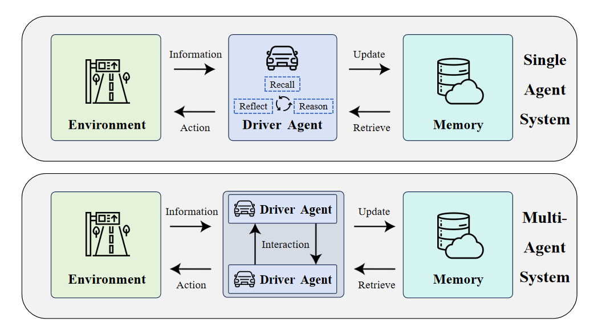
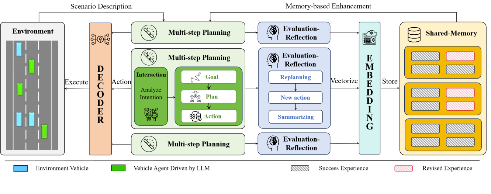

# KoMA: Knowledge-driven Multi-agent Framework for Autonomous Driving with Large Language Models
[](https://arxiv.org/abs/2407.14239)

The KoMA framework consisting of the multi-agent interaction, the multi-step planning,
the shared-memory, and the ranking-based reflection modules to enhance multi-agents’ decision-making in complex driving scenarios.
<p align="center">
     
     <br>Fig.1 The knowledge-driven paradigm for single driving agent system and multiple driving agents system. 
</p>

<p align="center">
     
     <br>Fig.2 Knowledge-driven autonomous driving framework KoMA that incorporates multiple agents empowered by LLMs.
</p>

## Getting Started

### Requirements
we recommend using conda to create an python virtual environment.

Note that if you want to use the Memory module, you need to run the code under linux
```python
conda create -n KoMA python=3.8
conda activate KoMA
pip install -r requirements.txt
```

### Configuration
All configurable parameters are located in `config.yaml`.

Before running KoMA, set up your OpenAI API keys in `config.yaml`.

### Using local LLMs
If you want to locally deploy some free open-source large language models via Ollama for testing, please download and deploy them according to the webpage `https://ollama.com/`. Note that you need to modify the `API_TYPE` in the `config.yaml` file and change the type of the large language model in `LLMDriver/driverAgent` (default is `llama3`).

### Running KoMA
```python
python main.py
```

## Usage

### Switching simulation scene
All simulation scenarios are set in `highway_env/envs`. 

The total number of vehicles in the initial simulation scenario does not exceed 8. We have only set up 8 random spawn locations for vehicles
You can customize the simulation scenario to solve this problem.

### one-lane
The configuration key 'KoMA-merge-generalization' should be replaced with 'KoMA-merge-onelane' in `main.py`.
```python
config={
    'KoMA-merge-onelane':
}
```
https://github.com/user-attachments/assets/11ebf560-6489-4bda-9eb9-91accdaccdd6

### three-lane
```python
config={
    'KoMA-merge-threelane':
}
```

https://github.com/user-attachments/assets/7c7461eb-8716-4409-be3a-488b69e0e8b1


### roundabout
```python
config={
    'KoMA-merge-roundabout':
}
```
https://github.com/user-attachments/assets/e437082f-98ce-49f8-b501-ae4faee3e4c5

## Result
All content is saved in the `./result/`, including videos and documents.

The vector database is stored in the `./db/` .


## Citing

If you use the project in your work, please consider citing it with:
```bibtex
@article{jiang2024koma,
  title={Koma: Knowledge-driven multi-agent framework for autonomous driving with large language models},
  author={Jiang, Kemou and Cai, Xuan and Cui, Zhiyong and Li, Aoyong and Ren, Yilong and Yu, Haiyang and Yang, Hao and Fu, Daocheng and Wen, Licheng and Cai, Pinlong},
  journal={IEEE Transactions on Intelligent Vehicles},
  year={2024},
  publisher={IEEE}
}
```

